<details>
<summary><b>Задание</b></summary>
# Домашнее задание к занятию 5. «Практическое применение Docker»

### Инструкция к выполнению

1. Для выполнения заданий обязательно ознакомьтесь с [инструкцией](https://github.com/netology-code/devops-materials/blob/master/cloudwork.MD) по экономии облачных ресурсов. Это нужно, чтобы не расходовать средства, полученные в результате использования промокода.
3. **Своё решение к задачам оформите в вашем GitHub репозитории.**
4. В личном кабинете отправьте на проверку ссылку на .md-файл в вашем репозитории.
5. Сопроводите ответ необходимыми скриншотами.

---
## Примечание: Ознакомьтесь со схемой виртуального стенда [по ссылке](https://github.com/netology-code/shvirtd-example-python/blob/main/schema.pdf)

---

## Задача 0
1. Убедитесь что у вас НЕ(!) установлен ```docker-compose```, для этого получите следующую ошибку от команды ```docker-compose --version```
```
Command 'docker-compose' not found, but can be installed with:

sudo snap install docker          # version 24.0.5, or
sudo apt  install docker-compose  # version 1.25.0-1

See 'snap info docker' for additional versions.
```
В случае наличия установленного в системе ```docker-compose``` - удалите его.  
2. Убедитесь что у вас УСТАНОВЛЕН ```docker compose```(без тире) версии не менее v2.24.X, для это выполните команду ```docker compose version```  
###  **Своё решение к задачам оформите в вашем GitHub репозитории!!!!!!!!!!!!!!!!!!!!!!!!!!!!!!!!**

---

## Задача 1
1. Сделайте в своем GitHub пространстве fork [репозитория](https://github.com/netology-code/shvirtd-example-python).

2. Создайте файл ```Dockerfile.python``` на основе существующего `Dockerfile`:
   - Используйте базовый образ ```python:3.12-slim```
   - Обязательно используйте конструкцию ```COPY . .``` в Dockerfile
   - Создайте `.dockerignore` файл для исключения ненужных файлов
   - Используйте ```CMD ["uvicorn", "main:app", "--host", "0.0.0.0", "--port", "5000"]``` для запуска
   - Протестируйте корректность сборки
2.1 Используйте multistage сборку вместо single stage.
3. (Необязательная часть, *) Изучите инструкцию в проекте и запустите web-приложение без использования docker, с помощью venv. (Mysql БД можно запустить в docker run).
4. (Необязательная часть, *) Изучите код приложения и добавьте управление названием таблицы через ENV переменную.
---
### ВНИМАНИЕ!
!!! В процессе последующего выполнения ДЗ НЕ изменяйте содержимое файлов в fork-репозитории! Ваша задача ДОБАВИТЬ 5 файлов: ```Dockerfile.python```, ```compose.yaml```, ```.gitignore```, ```.dockerignore```,```bash-скрипт```. Если вам понадобилось внести иные изменения в проект - вы что-то делаете неверно!
---

## Задача 2 (*)
1. Создайте в yandex cloud container registry с именем "test" с помощью "yc tool" . [Инструкция](https://cloud.yandex.ru/ru/docs/container-registry/quickstart/?from=int-console-help)
2. Настройте аутентификацию вашего локального docker в yandex container registry.
3. Соберите и залейте в него образ с python приложением из задания №1.
4. Просканируйте образ на уязвимости.
5. В качестве ответа приложите отчет сканирования.

## Задача 3
1. Изучите файл "proxy.yaml"
2. Создайте в репозитории с проектом файл ```compose.yaml```. С помощью директивы "include" подключите к нему файл "proxy.yaml".
3. Опишите в файле ```compose.yaml``` следующие сервисы: 

- ```web```. Образ приложения должен ИЛИ собираться при запуске compose из файла ```Dockerfile.python``` ИЛИ скачиваться из yandex cloud container registry(из задание №2 со *). Контейнер должен работать в bridge-сети с названием ```backend``` и иметь фиксированный ipv4-адрес ```172.20.0.5```. Сервис должен всегда перезапускаться в случае ошибок.
Передайте необходимые ENV-переменные для подключения к Mysql базе данных по сетевому имени сервиса ```web``` 

- ```db```. image=mysql:8. Контейнер должен работать в bridge-сети с названием ```backend``` и иметь фиксированный ipv4-адрес ```172.20.0.10```. Явно перезапуск сервиса в случае ошибок. Передайте необходимые ENV-переменные для создания: пароля root пользователя, создания базы данных, пользователя и пароля для web-приложения.Обязательно используйте уже существующий .env file для назначения секретных ENV-переменных!

2. Запустите проект локально с помощью docker compose , добейтесь его стабильной работы: команда ```curl -L http://127.0.0.1:8090``` должна возвращать в качестве ответа время и локальный IP-адрес. Если сервисы не стартуют воспользуйтесь командами: ```docker ps -a ``` и ```docker logs <container_name>``` . Если вместо IP-адреса вы получаете информационную ошибку --убедитесь, что вы шлете запрос на порт ```8090```, а не 5000.

5. Подключитесь к БД mysql с помощью команды ```docker exec -ti <имя_контейнера> mysql -uroot -p<пароль root-пользователя>```(обратите внимание что между ключем -u и логином root нет пробела. это важно!!! тоже самое с паролем) . Введите последовательно команды (не забываем в конце символ ; ): ```show databases; use <имя вашей базы данных(по-умолчанию virtd, как это указано в .env)>; show tables; SELECT * from requests LIMIT 10;```. Примечание: таблица в БД создается после первого поступившего запроса к приложению.

6. Остановите проект. В качестве ответа приложите скриншот sql-запроса.

## Задача 4
1. Запустите в Yandex Cloud ВМ (вам хватит 2 Гб Ram).
2. Подключитесь к Вм по ssh и установите docker.
3. Напишите bash-скрипт, который скачает ваш fork-репозиторий в каталог /opt и запустит проект целиком.
4. Зайдите на сайт проверки http подключений, например(или аналогичный): ```https://check-host.net/check-http``` и запустите проверку вашего сервиса ```http://<внешний_IP-адрес_вашей_ВМ>:8090```. Таким образом трафик будет направлен в ingress-proxy. Трафик должен пройти через цепочки: Пользователь → Internet → Nginx → HAProxy → FastAPI(запись в БД) → HAProxy → Nginx → Internet → Пользователь
5. (Необязательная часть) Дополнительно настройте remote ssh context к вашему серверу. Отобразите список контекстов и результат удаленного выполнения ```docker ps -a```
6. Повторите SQL-запрос на сервере и приложите скриншот и ссылку на fork.

## Задача 5 (*)
1. Напишите и задеплойте на вашу облачную ВМ bash скрипт, который произведет резервное копирование БД mysql в директорию "/opt/backup" с помощью запуска в сети "backend" контейнера из образа ```schnitzler/mysqldump``` при помощи ```docker run ...``` команды. Подсказка: "документация образа."
2. Протестируйте ручной запуск
3. Настройте выполнение скрипта раз в 1 минуту через cron, crontab или systemctl timer. Придумайте способ не светить логин/пароль в git!!
4. Предоставьте скрипт, cron-task и скриншот с несколькими резервными копиями в "/opt/backup"

## Задача 6
Скачайте docker образ ```hashicorp/terraform:latest``` и скопируйте бинарный файл ```/bin/terraform``` на свою локальную машину, используя dive и docker save.
Предоставьте скриншоты  действий .


</details>

-----
-----


<details>
<summary><b>Ответ Задача 0</b></summary>

> 📸 ** Скриншот команд:** 📸
> 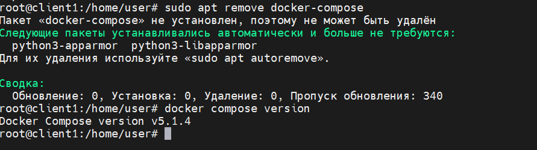


</details>

-----
-----
<details>
<summary><b>Ответ Задача 1</b></summary>


В этой задаче я упаковал готовый код на Python в Docker-образ, используя multistage (многоэтапную) сборку.
Обычно установка библиотек Python оставляет много системного мусора (кэш, временные файлы компиляторов). Multistage позволил мне на «первом этапе» скачать и скомпилировать всё необходимое, а на «втором этапе» взять абсолютно чистую систему и скопировать туда только готовые файлы. Образ получается легким.

## Шаг 1. Создание Fork (копии) репозитория в GitHub
Я сделал форк оригинального кода Нетологии в свой личный аккаунт GitHub, нажав кнопку **Fork** на странице репозитория. 

## Шаг 2. Скачивание проекта на виртуальную машину
Затем я перенес код на свою виртуальную машину Linux с помощью команды клонирования и перешел в рабочую директорию проекта:

```bash
git clone [https://github.com/alexandr8517/shvirtd-example-python.git](https://github.com/alexandr8517/shvirtd-example-python.git)
cd shvirtd-example-python
```
## Шаг 3. Создание файла-фильтра .dockerignore
Я создал файл .dockerignore. Он работает как фильтр, который указывает Докеру, какие локальные файлы нельзя копировать внутрь образа (чтобы не занести туда случайные пароли или тяжелые временные файлы).
```bash
cat << 'EOF' > .dockerignore
.git
__pycache__
venv
.env
README.md
EOF
```
## Шаг 4. Создание инструкции Dockerfile.python

```bash
cat << 'EOF' > Dockerfile.python
# === ЭТАП 1: Сборка (builder) ===
# Берем официальный легкий образ Python
FROM python:3.12-slim AS builder
# Указываем рабочую папку внутри контейнера
WORKDIR /app
# Копируем файл со списком библиотек из папки проекта
COPY requirements.txt .
# Скачиваем нужные библиотеки в специальную папку /app/wheels
RUN pip wheel --no-cache-dir --no-deps --wheel-dir /app/wheels -r requirements.txt


# === ЭТАП 2: Финальный чистый образ ===
# Снова берем чистый образ Python
FROM python:3.12-slim
WORKDIR /app
# Копируем УЖЕ СКАЧАННЫЕ библиотеки из первого этапа (builder)
COPY --from=builder /app/wheels /wheels
COPY --from=builder /app/requirements.txt .
# Устанавливаем их без создания лишнего кэша
RUN pip install --no-cache /wheels/*
# Копируем весь исходный код приложения из сделанного Fork
COPY . .
# Указываем команду для запуска веб-сервера uvicorn и открытия порта 5000
CMD ["uvicorn", "main:app", "--host", "0.0.0.0", "--port", "5000"]
EOF
```
## Шаг 5. Тестирование сборки
Файлы готовы. Теперь я запустил сборку готового образа:

Флаг -t custom-python-app:1.0.0 задает образу имя и версию (тег).

Флаг -f Dockerfile.python явно указывает имя файла, так как оно нестандартное.

. (точка в конце) указывает Докеру искать файлы в текущей папке.
```bash
docker build -t custom-python-app:1.0.0 -f Dockerfile.python .
```

> 📸 ** Cкриншот терминала с успешным завершением сборки образа:** 📸
> 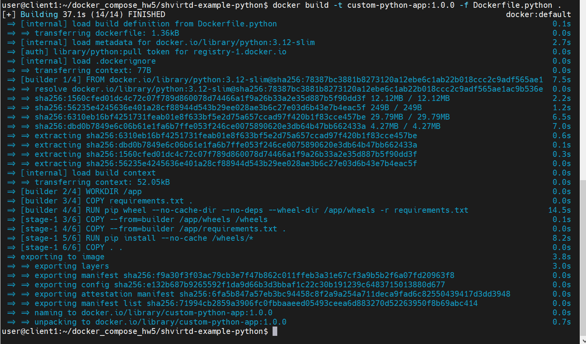


## Шаг 6. (Необязательный) Запуск приложения локально через venv
Я изучил инструкцию и запустил веб-приложение локально без использования сборки Docker-образа самого приложения. Для этого я использовал виртуальное окружение Python (venv) и запустил отдельный контейнер с базой данных MySQL.

```bash
# 1. Создаю виртуальное окружение
python3 -m venv venv

# 2. Активирую его
source venv/bin/activate

# 3. Устанавливаю зависимости приложения прямо в систему
pip install -r requirements.txt

# 4. Запускаю временную БД MySQL в Докере для тестов
docker run -d --name mysql-test-db \
  -p 3306:3306 \
  -e MYSQL_ROOT_PASSWORD=secret \
  -e MYSQL_DATABASE=virtd \
  -e MYSQL_USER=app \
  -e MYSQL_PASSWORD=app \
  mysql:8

# 5. Экспортирую переменные окружения для подключения приложения к БД
export DB_HOST=127.0.0.1
export DB_USER=app
export DB_PASSWORD=app
export DB_NAME=virtd

# 6. Запускаю веб-сервер uvicorn локально
uvicorn main:app --host 0.0.0.0 --port 5000
```

> 📸 ** Скриншот терминала, показывающий, что сервер uvicorn успешно запустился локально:** 📸
> 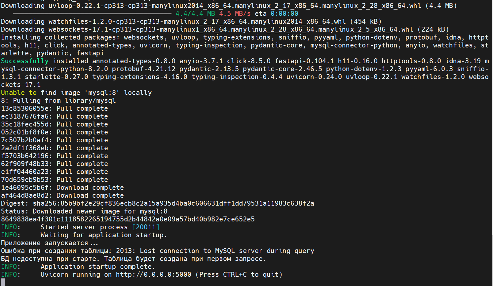
> 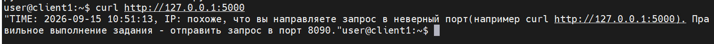

## Шаг 7. (Необязательный) Управление названием таблицы через ENV переменную
Чтобы приложение не было жестко привязано к одному имени таблицы, я изменил исходный код, добавив чтение имени из переменной окружения.

Я открыл файл main.py (или файл с моделями базы данных) через редактор nano и внес следующие изменения:


1. Добавил чтение переменной в конфигурационный блок приложения:
   `table_name = os.environ.get('TABLE_NAME', 'requests')`
2. Перевел SQL-запросы на использование f-строк, заменив жестко заданное имя таблицы `requests` на вызов переменной `{table_name}` (например: `f"INSERT INTO {table_name}..."`).

- Запускаю команду сборки:
```bash
docker build -t custom-python-app:1.0.0 -f Dockerfile.python .
```
> 📸 ** Скриншот терминала, показывающий, что сервер uvicorn успешно запустился локально:** 📸
> 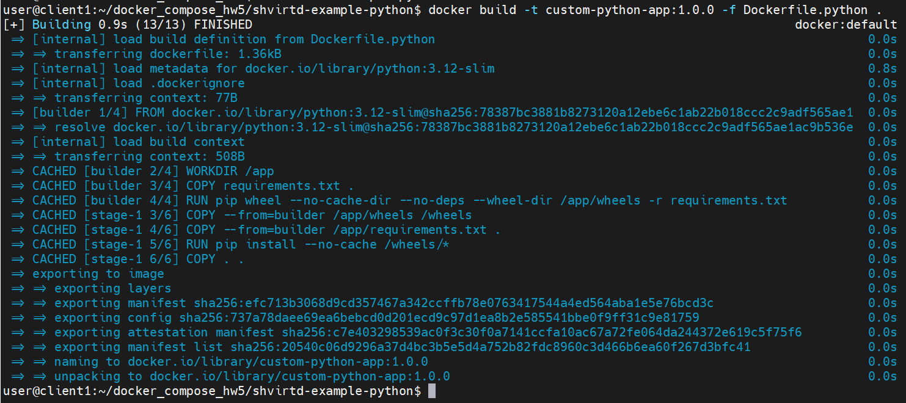


Чтобы убедиться, что код успешно читает переменные, а Докер-образ собран без ошибок, я провел тест с помощью временных контейнеров.

**1. Запуск тестовой базы данных**
Сначала я запустил чистый контейнер с базой данных MySQL. Флаг `-d` запускает его в фоновом режиме, `--rm` говорит удалить контейнер после остановки, а флаги `-e` передают логины и пароли внутрь контейнера:
```bash
docker run -d --rm --name test-db -e MYSQL_ROOT_PASSWORD=123 -e MYSQL_DATABASE=virtd -e MYSQL_USER=app -e MYSQL_PASSWORD=app -p 3306:3306 mysql:8
```
**2. Запуск приложения с кастомным именем таблицы**
Затем я запустил свой собранный образ приложения. С помощью флага -e TABLE_NAME=mega_table я передал внутрь нестандартное имя для таблицы, чтобы проверить, подхватит ли его мой код:
```bash
docker run -d --rm --name test-app --network host -e DB_HOST=127.0.0.1 -e DB_USER=app -e DB_PASSWORD=app -e DB_NAME=virtd -e TABLE_NAME=mega_table custom-python-app:1.0.0
```
***3. Инициализация создания таблицы***
Поскольку приложение создает таблицу только при первом запросе от клиента, я сымитировал заход пользователя с помощью консольной утилиты curl:
```bash
curl [http://127.0.0.1:5000](http://127.0.0.1:5000)
```
> 📸 ** Скриншот терминала, показывающий отработку с таблицами:** 📸
> 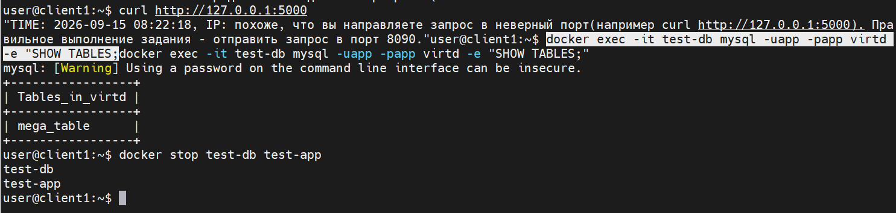

</details>

-----
-----

<details>
<summary><b>Ответ Задача 2 Создание Yandex Container Registry и пуш образа (не обязательно)</b></summary>

## Задача 2. Создание Yandex Container Registry и пуш образа

Для того чтобы мой Docker-образ был доступен для развертывания на удаленных серверах, я создал приватный реестр в Yandex Cloud. 

1. С помощью утилиты `yc` я создал реестр: 
   `yc container registry create --name netology-registry`
2. Получил ID созданного реестра через команду:
   `yc container registry list`
3. Настроил локальный Docker для аутентификации в Yandex Cloud с помощью команды `yc container registry configure-docker`, чтобы получить права на загрузку (push) образов.

> 📸 ** Скриншот созданного реестра:** 📸
> 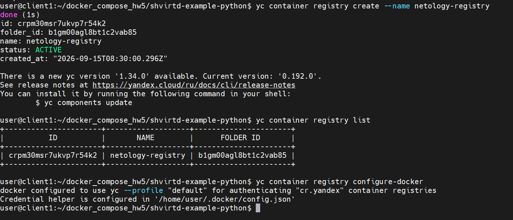

**Решение проблемы со сканированием уязвимостей:**
При попытке запустить сканер уязвимостей в Yandex Cloud я столкнулся с ошибкой формата `application/vnd.oci.image.index.v1+json`. Это связано с тем, что новые версии Docker по умолчанию создают составные образы с манифестами (provenance attestation), которые пока не поддерживаются сканером Яндекса. 

Для решения проблемы я пересобрал образ, принудительно отключив новые слои:
`docker build --provenance=false -t custom-python-app:1.0.0 -f Dockerfile.python .`

4. После успешной пересборки я повесил новый тег с адресом моего реестра:
   `docker tag custom-python-app:1.0.0 cr.yandex/crpm30msr7ukvp7r54k2/custom-python-app:1.0.0`
5. Успешно загрузил образ в облачное хранилище:
   `docker push cr.yandex/crpm30msr7ukvp7r54k2/custom-python-app:1.0.0`
6. В веб-интерфейсе Яндекс Облака я перешел в раздел Container Registry, нашел загруженный тег `1.0.0` и успешно запустил встроенный сканер уязвимостей.

> 📸 **[МЕСТО ДЛЯ СКРИНШОТА 4]:** *Скриншот из веб-интерфейса Yandex Cloud с результатами успешного сканирования образа на уязвимости.*

> 📸 ** Скриншот из веб-интерфейса Yandex Cloud с результатами успешного сканирования образа на уязвимости:** 📸
> 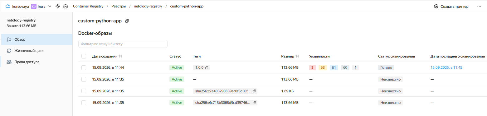
> 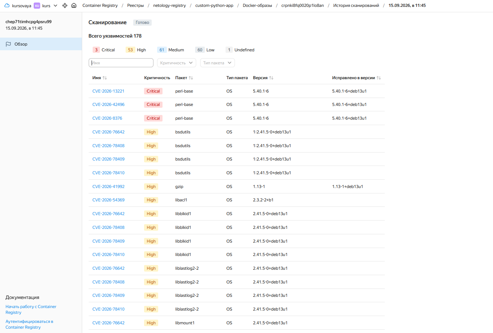


</details>

-----
-----

<details>
<summary><b>Ответ Задача 3 (Развертывание микросервисной архитектуры через Docker Compose)</b></summary>

## Задача 3. Развертывание микросервисной архитектуры через Docker Compose

Для оркестрации всех сервисов я создал файл `compose.yaml` в корне репозитория и использовал встроенную директиву `include` для подключения готового файла `proxy.yaml`. Исходный код репозитория остался неизменным.

### 1. Конфигурационные файлы

Для работы стека я использовал следующие файлы конфигурации:

**Файл `.env` (секретные переменные окружения):**
```env
MYSQL_ROOT_PASSWORD="YtReWq4321"
MYSQL_DATABASE="virtd"
MYSQL_USER="app"
MYSQL_PASSWORD="QwErTy1234"
```

### 2. Файл compose.yaml (описание сервисов и сети):
```yaml
include:
  - proxy.yaml

services:
  web:
    image: cr.yandex/crpm30msr7ukvp7r54k2/custom-python-app:1.0.0
    restart: always
    networks:
      backend:
        ipv4_address: 172.20.0.5
    environment:
      - DB_HOST=db
      - DB_USER=${MYSQL_USER}
      - DB_PASSWORD=${MYSQL_PASSWORD}
      - DB_NAME=${MYSQL_DATABASE}

  db:
    image: mysql:8
    restart: on-failure
    networks:
      backend:
        ipv4_address: 172.20.0.10
    environment:
      - MYSQL_ROOT_PASSWORD=${MYSQL_ROOT_PASSWORD}
      - MYSQL_DATABASE=${MYSQL_DATABASE}
      - MYSQL_USER=${MYSQL_USER}
      - MYSQL_PASSWORD=${MYSQL_PASSWORD}

```

### 3. Запуск и проверка инфраструктуры
- Я запустил весь стек микросервисов в фоновом режиме с помощью команды:
docker compose up -d
> 📸 ** Скриншот запуска стека микросервисов в фоновом режиме :** 📸
> 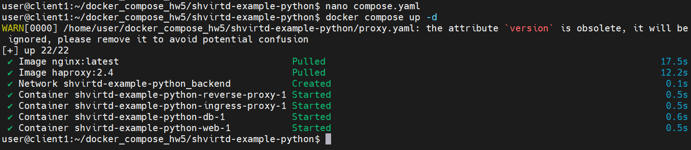
- Проверил корректность маршрутизации запросов через прокси-сервер с помощью утилиты curl:
curl -L http://127.0.0.1:8090
  Команда успешно вернула текущее время и локальный IP-адрес.

> 📸 ** Скриншот терминала, на котором запечатлен успешный ответ от утилиты curl на порту 8090:** 📸
> 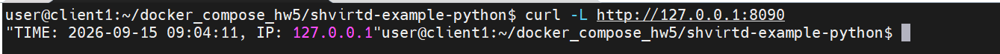

- Для проверки записи данных я подключился к запущенному контейнеру MySQL под учетной записью root:
```docker exec -it shvirtd-example-python-db-1 mysql -uroot -pYtReWq4321```

- Последовательно выполнил SQL-запросы для проверки структуры базы данных и содержимого таблицы requests:
```text
show databases;
use virtd;
show tables;
SELECT * from requests LIMIT 10;
```
> 📸 ** Скриншот терминала с выполненными SQL-командами и выводом таблицы с историей запросов:** 📸
> 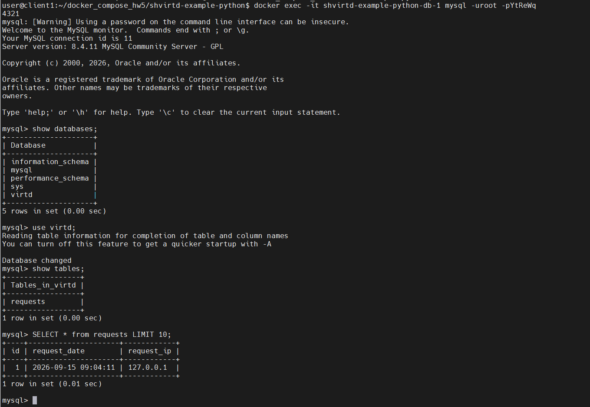

</details>

-----
-----

<details>
<summary><b>Ответ Задача 4</b></summary>

**1. Создание файлов и первый запуск**

Развертывание инфраструктуры проекта в Yandex Cloud с использованием Terraform, Docker Compose и автоматизацией развертывания через bash-скрипт.

* **Внешний IP-адрес ВМ:** `84.252.128.69`
* **Опубликованный порт приложения:** `8090`

---

### 1. Создание виртуальной машины в Yandex Cloud (Terraform)

Для развертывания виртуальной машины в каталоге `terraform` был подготовлен единый файл манифеста `main.tf`.

#### `terraform/main.tf`
```hcl
terraform {
  required_providers {
    yandex = {
      source = "yandex-cloud/yandex"
    }
  }
  required_version = ">= 0.13"
}

provider "yandex" {
  zone = "ru-central1-a"
}

resource "yandex_vpc_network" "develop" {
  name = "develop"
}

resource "yandex_vpc_subnet" "develop" {
  name           = "develop-ru-central1-a"
  zone           = "ru-central1-a"
  network_id     = yandex_vpc_network.develop.id
  v4_cidr_blocks = ["10.0.1.0/24"]
}

resource "yandex_compute_instance" "vm" {
  name        = "netology-develop-platform-web"
  platform_id = "standard-v3"
  zone        = "ru-central1-a"

  resources {
    cores         = 2
    memory        = 2
    core_fraction = 20
  }

  boot_disk {
    initialize_params {
      image_id = "fd80bm0rh4rkepi5ks0q" # Ubuntu 22.04 LTS
      size     = 15
    }
  }

  network_interface {
    subnet_id = yandex_vpc_subnet.develop.id
    nat       = true
  }

  metadata = {
    serial-port-enable = 1
    ssh-keys           = "ubuntu:${file("~/.ssh/netology_id_rsa.pub")}"
  }
}
```

### 2. Конфигурация контейнеров и приложения
В проекте настроена локальная сборка образа сервиса web с установкой зависимостей и изоляция сервисов в кастомной bridge-сети.

shvirtd-example-python/Dockerfile

```text

FROM python:3.12-slim

WORKDIR /app

COPY requirements.txt requirements.txt
RUN pip install --no-cache-dir -r requirements.txt

COPY . .

# Запускаем приложение с помощью uvicorn, делая его доступным по сети
CMD ["uvicorn", "main:app", "--host", "0.0.0.0", "--port", "5000"]

```

shvirtd-example-python/requirements.txt

```text
fastapi==0.104.1
uvicorn[standard]==0.24.0
mysql-connector-python==8.2.0
cryptography
```

shvirtd-example-python/compose.yaml

```text
include:
  - proxy.yaml

services:
  web:
    build: .
    image: custom-python-app:1.0.0
    restart: always
    networks:
      backend:
        ipv4_address: 172.20.0.5
    environment:
      - DB_HOST=db
      - DB_USER=${MYSQL_USER}
      - DB_PASSWORD=${MYSQL_PASSWORD}
      - DB_NAME=${MYSQL_DATABASE}

  db:
    image: mysql:8
    restart: on-failure
    networks:
      backend:
        ipv4_address: 172.20.0.10
    environment:
      - MYSQL_ROOT_PASSWORD=${MYSQL_ROOT_PASSWORD}
      - MYSQL_DATABASE=${MYSQL_DATABASE}
      - MYSQL_USER=${MYSQL_USER}
      - MYSQL_PASSWORD=${MYSQL_PASSWORD}

networks:
  backend:
    driver: bridge
    ipam:
      config:
        - subnet: 172.20.0.0/16
```

### 3. Автоматизация развертывания (deploy.sh)
Bash-скрипт развертывания клонирует/обновляет проект, генерирует файл окружения .env и запускает контейнеры:
```bash
#!/bin/bash
set -e

echo "=== Шаг 1. Клонируем или обновляем проект с GitHub ==="
cd /opt
if [ ! -d "docker_compose_hw5" ]; then
    git clone https://github.com/alexandr-bobkov/docker_compose_hw5.git
else
    cd docker_compose_hw5
    rm -f shvirtd-example-python/.env
    git pull
fi

cd /opt/docker_compose_hw5/shvirtd-example-python

echo "=== Шаг 2. Создаем файл .env ==="
cat << 'EOF' > .env
MYSQL_ROOT_PASSWORD="YtReWq4321"
MYSQL_DATABASE="virtd"
MYSQL_USER="app"
MYSQL_PASSWORD="QwErTy1234"
EOF

echo "=== Шаг 3. Запускаем проект через docker compose ==="
sudo docker compose up -d --build
echo "=== Деплой успешно завершен! ==="
```
### 4. Результаты работы и тестирование
sudo docker ps
> 📸 ** Скриншот терминала с выполненной командой:** 📸
> 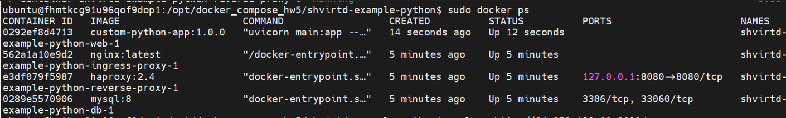

Проверка доступности сервиса (Check-Host)
Проверка ответа приложения через внешний порт 8090:
```bash
curl -v http://84.252.128.69:8090
```
> 📸 ** Скриншот терминала с выполненной командой:** 📸
> 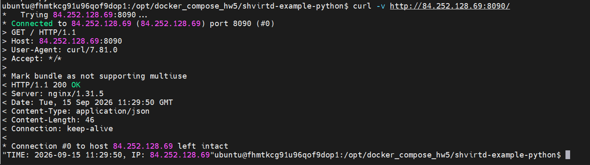

Фиксация запросов в базе данных MySQL
Проверка сохранения истории обращений в таблице requests:

```bash
sudo docker compose exec db mysql -uapp -pQwErTy1234 virtd -e "SELECT * FROM requests;"
```
> 📸 ** Скриншот терминала с выполненной командой:** 📸
> 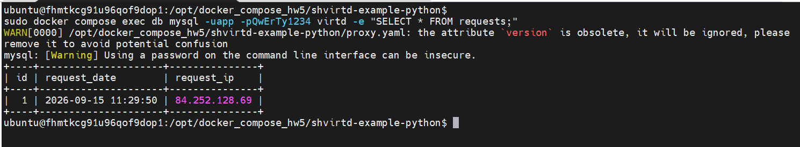


</details>

-----
-----

<details>
<summary><b>Ответ Задача 5</b></summary>

### 1. Подготовка базы данных/

В свежих версиях образа `mysql:8` по умолчанию отключен устаревший метод авторизации `mysql_native_password`, который необходим для работы клиента MariaDB внутри образа `schnitzler/mysqldump`. 

Для исправления совместимости в `compose.yaml` был добавлен параметр запуска для сервиса БД (`command: --mysql-native-password=ON`):

```yaml
include:
  - proxy.yaml

services:
  web:
    build: .
    image: custom-python-app:1.0.0
    restart: always
    networks:
      backend:
        ipv4_address: 172.20.0.5
    environment:
      - DB_HOST=db
      - DB_USER=${MYSQL_USER}
      - DB_PASSWORD=${MYSQL_PASSWORD}
      - DB_NAME=${MYSQL_DATABASE}

  db:
    image: mysql:8
    command: --mysql-native-password=ON
    restart: on-failure
    networks:
      backend:
        ipv4_address: 172.20.0.10
    environment:
      - MYSQL_ROOT_PASSWORD=${MYSQL_ROOT_PASSWORD}
      - MYSQL_DATABASE=${MYSQL_DATABASE}
      - MYSQL_USER=${MYSQL_USER}
      - MYSQL_PASSWORD=${MYSQL_PASSWORD}
```

После этого пользователю app был изменен плагин авторизации:

```bash
ALTER USER 'app'@'%' IDENTIFIED WITH mysql_native_password BY 'QwErTy1234';
FLUSH PRIVILEGES;
```

### 2. Скрипт резервного копирования (backup.sh)
Для исключения утечки учетных данных в Git скрипт считывает логин, пароль и имя базы из файла .env, который добавлен в .gitignore и размещается только на сервере.
В команду запуска добавлены:

Флаг --entrypoint "" (согласно документации образа schnitzler/mysqldump, так как по умолчанию там запускается crond).

Флаг --no-tablespaces (для решения проблемы нехватки прав на чтение системных таблиц у пользователя app).

Файл: shvirtd-example-python/backup.sh

```bash
#!/bin/bash
set -e

ENV_FILE="/opt/docker_compose_hw5/shvirtd-example-python/.env"

if [ -f "$ENV_FILE" ]; then
    export $(grep -v '^#' "$ENV_FILE" | xargs)
else
    echo "Ошибка: файл $ENV_FILE не найден!" >&2
    exit 1
fi

BACKUP_DIR="/opt/backup"
mkdir -p "$BACKUP_DIR"

TIMESTAMP=$(date +"%Y%m%d_%H%M%S")
BACKUP_FILE="${BACKUP_DIR}/dump_${TIMESTAMP}.sql"

docker run --rm \
    --entrypoint "" \
    --network shvirtd-example-python_backend \
    schnitzler/mysqldump \
    mysqldump -h db -u "${MYSQL_USER}" -p"${MYSQL_PASSWORD}" --no-tablespaces "${MYSQL_DATABASE}" > "${BACKUP_FILE}"

echo "Резервная копия успешно создана: ${BACKUP_FILE}"
```


### 3. Настройка расписания в cron
Для выполнения скрипта каждую минуту задача добавлена в crontab пользователя root на виртуальной машине. Также она продублирована в репозитории в файле shvirtd-example-python/cron-task.txt.

Команда в crontab -l:

```bash
* * * * * /opt/docker_compose_hw5/shvirtd-example-python/backup.sh >> /var/log/backup.log 2>&1
```

### 4. Результат работы
Скрипт резервного копирования успешно запустился планировщиком cron несколько раз.

На скриншоте ниже представлено содержимое директории /opt/backup (ls -la /opt/backup). Размер последних дампов составляет более 0 байт (2005 байт), что подтверждает успешную выгрузку структуры и данных таблицы requests из базы данных.

> 📸 ** Скриншот содержимое директории /opt/backup:** 📸
> 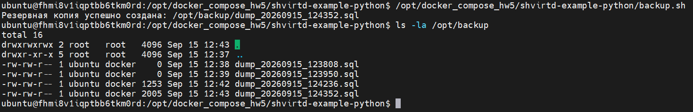

> 📸 ** Скриншот содержимого  crontab -l:** 📸
> 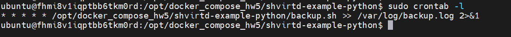


</details>

-----
-----

<details>
<summary><b>Ответ Задача 6</b></summary>

**1. Установка инструментария**

Для визуального анализа слоев образа на локальную машину  была установлена утилита `dive`. Установка производилась из официального релиза GitHub:
```bash
wget [https://github.com/wagoodman/dive/releases/download/v0.12.0/dive_0.12.0_linux_amd64.deb](https://github.com/wagoodman/dive/releases/download/v0.12.0/dive_0.12.0_linux_amd64.deb)
sudo apt install ./dive_0.12.0_linux_amd64.deb
```

**2. Загрузка и анализ образа через dive**

Сначала был загружен актуальный образ Terraform:

```bash
docker pull hashicorp/terraform:latest
```

Затем образ был проанализирован командой:

```bash
dive hashicorp/terraform:latest
```
В интерфейсе dive реализован механизм просмотра: в левой панели отображаются команды сборки (и формируемые ими слои), а в правой — изменения файловой системы выбранного слоя. Перемещаясь по дереву слоев, был найден слой размером около 120 MB (команда COPY dist/linux/amd64/terraform /bin/terraform). Именно в этот момент сборки в систему был добавлен искомый бинарный файл /bin/terraform.

> 📸 ** Скриншот содержимого  dive:** 📸
> 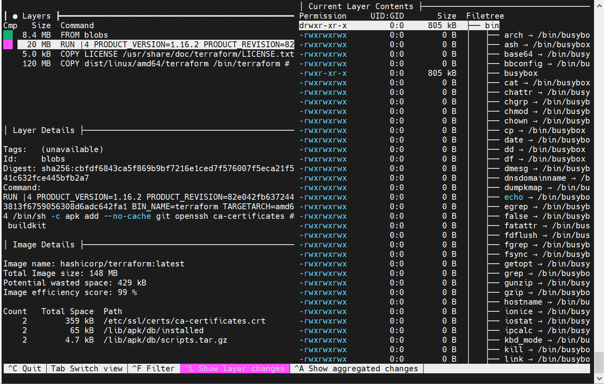

***3. Выгрузка образа в архив (docker save)***

- Для ручного извлечения файла образ был экспортирован из внутреннего хранилища Docker в обычный tar-архив. Затем архив был распакован во временную директорию:

```bash
docker save -o terraform_image.tar hashicorp/terraform:latest
mkdir -p terraform_extract && tar -xf terraform_image.tar -C terraform_extract/
```
***4. Поиск и извлечение файла из OCI-структуры***
- Современные версии Docker (с containerd) выгружают образы в формате стандарта OCI (Open Container Initiative), где слои хранятся в директории blobs/sha256/ в виде файлов-архивов без расширения, названных по их хэш-суммам.

- Чтобы не распаковывать каждый слой вручную в поисках нужного бинарника, был применен bash-цикл. Он перебирает все blob-файлы и пытается извлечь из них только конкретный путь bin/terraform. Ошибки распаковки (для слоев, где этого файла нет) подавляются перенаправлением в /dev/null:

```bash
cd /home/user/docker_compose_hw5/terraform_extract
for layer in blobs/sha256/*; do tar -xf "$layer" bin/terraform 2>/dev/null && echo "Файл успешно извлечен из слоя $layer"; done
```
Как видно на скриншоте ниже, цикл успешно обнаружил и извлек файл из слоя с хэшем c6075c0f1a1d3420be041937e59dd0c93624296d6b8df9b53ba33bf977319c27

> 📸 ** Скриншот файл из слоя:** 📸
> 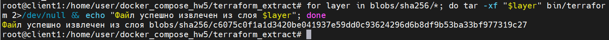

***5. Проверка работоспособности извлеченного файла***

- После успешного извлечения файла были проверены его атрибуты (размер составил 115 МБ) и произведен тестовый запуск на локальной хост-машине:

```bash
ls -lh bin/terraform
./bin/terraform --version
```
> 📸 ** Скриншот работоспособности:** 📸
> 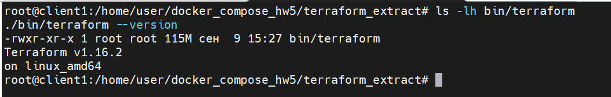


</details>
